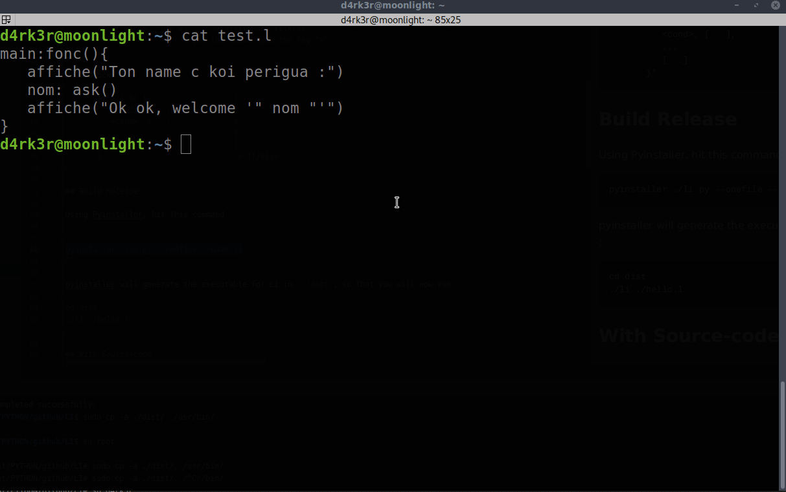

# LI

In French "langage interprété" Or `IL` in english for Interpreted Language, is a simple programming language Based on some Python Classes.



## Requirements

- Python (3.x) is all you need.
- PyInstaller (pip3 install pyinstaller) |Optional, if you want to generate the executable of li
- Any lib required.

## Features

 - Easily extendable with modules.
 - First class functions.
 - String, list, number, dictionary, null, and function types

## Build the portable version

Using Pyinstaller, hit this command to install pyinstaller :

```
pip3 install pyinstaller
```

Then to build the li portable version :

```
cd to/the/project
pyinstaller ./li.py --onefile --name li
```

pyinstaller will generate the executable for Li in `./dist`, so that you will now run :
```
cd dist
./li ./hello.l
```

## With Source-code

Or using the sour-code by running li's script with :
`python li.py ./hello.l`


## Examples and tests

Example of LI code :
INPUT:
```
main:fonc() {
    affiche_xa("Hello World !!!")
    affiche( "Taille de [1,2,3] =" taille( [1,2,3] ) )
}
```

OUTPUT:
```
Li 0.1 Build using Python 3.7.3
Hit `run li your_script.l`, for more information contact @sanixdarker.
--
Hello World !!!
Taille de [1,2,3]  : 3
```

## Tests

You can performs some tests now :

Hit theese commands:

```shell
# The simple hello world script
li ./hello.l
```

- EXPECTED OUTPUT :
```
Li 0.1 Build using Python 3.7.3
Hit `run li your_script.l`, for more information contact @sanixdarker.
--
Hello World !!!
Taille de [1,2,3]  : 3
```

----

```
# The count-down from 100 to 0
li ./tests/count.l
```

EXPECTED OUTPUT :
```
Li 0.1 Build using Python 3.7.3
Hit `run li your_script.l`, for more information contact @sanixdarker.
--
Simple count down from
100
100 99 98 97 96 95 94 93 92 91 90 89 88 87 86 85 84 83 82 81 80 79 78 77 76 75 74 73 72 71 70 69 68 67 66 65 64 63 62 61 60 59 58 57 56 55 54 53 52 51 50 49 48 47 46 45 44 43 42 41 40 39 38 37 36 35 34 33 32 31 30 29 28 27 26 25 24 23 22 21 20 19 18 17 16 15 14 13 12 11 10 9 8 7 6 5 4 3 2 1 
```

## Syntax

- Basic
```
    - 'a: 5'                     -> assignment
    - 'fct:fonc(): {...}'                 -> function definition
    - 'import("test_import_file")'  -> import a module
```

- Lists
```
    - 'test: [1, 2, 3]'           -> list literal
    - 'del(l)'              -> delete and return first element in list
    - 'ins(l 0 5)'           -> insert 5 into the beginning of the list
```

- Dictionaries
```
    - 'lt: {"a": 5, "b": 2}'    -> dictionary literal
    - 'lt["a"]'          -> get the value with the key "a"
```

- If block
```
    - 'if >(i 0) {                   |
          <cond>, [...],             |
          <cond>, [...],             |
          ...                        |
          [...]                      |
       }'                            -> if/else
```

## Author

- Sanix-darker